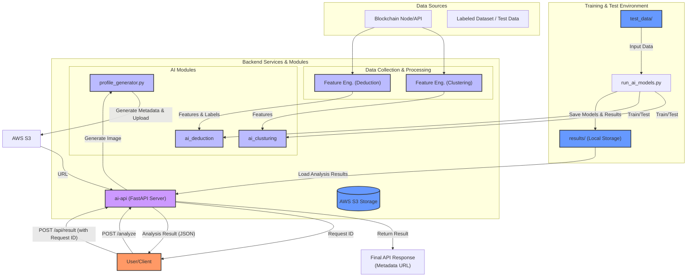
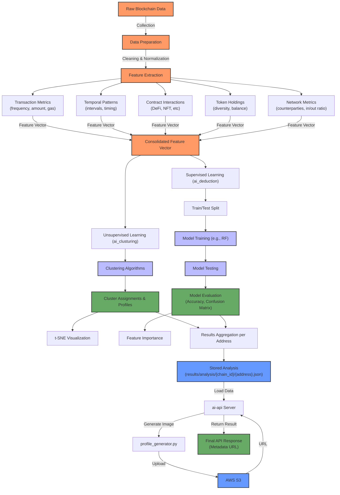
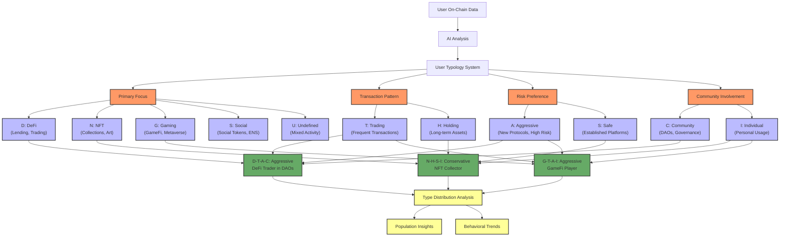

# aidrop-core

# On-Chain User Classification MVP

## Overview

This project is a web-based MVP platform that analyzes EVM blockchain user data using AI. The system connects to a selected EVM-compatible blockchain, collects on-chain data for user addresses, applies trained machine learning models (unsupervised clustering and supervised classification) to classify/profile users, and presents the results through a FastAPI-based API server. It also includes functionality for generating AI profile images based on the analysis and uploading them to AWS S3.

## Key Features

- **Blockchain Data Ingestion**: Connect to EVM chains and retrieve on-chain data like transaction history, token holdings, and contract interaction records for wallet addresses.
- **Data Processing & Storage**: Parse and normalize raw on-chain data, extract key metrics and features.
- **AI Learning & Training**: Construct labeled dataset of addresses with known classifications and train AI/ML models using provided test scripts (`test_data/run_ai_models.py`).
- **Dual Learning Approach**: Implements both unsupervised (`ai_clusturing`) and supervised (`ai_deduction`) learning.
- **User Personality Typing**: Classifies users into 16+ distinct types based on four behavioral axes, predicted by the supervised model.
- **Marketing Targeting**: Extracts target user segments based on on-chain behavior and AI analysis results (`marketing_targeting`).
- **Marketing Campaign Tracking**: Monitors on-chain activities of targeted user groups and generates performance metrics (`marketing_tracking`).
- **AI Profile Image Generation**: Generates profile images using OpenAI API based on analysis results (`profile_generator.py`).
- **API Server**: FastAPI-based server (`ai-api`) providing endpoints for analysis requests and result retrieval, featuring asynchronous background processing.
- **Cloud Integration**: Uploads generated images and metadata to AWS S3.

## Project Structure

```
aidrop-core/
├── ai_clusturing/          # Unsupervised learning (clustering) module
│   ├── main.py             # Executes clustering analysis (e.g., analyze_new_address)
│   ├── clustering.py       # Implements clustering models (e.g., K-Means)
│   ├── cluster_analyzer.py # Analyzes cluster characteristics and profiles
│   ├── feature_extraction.py # Feature extraction logic for clustering
│   └── ...
├── ai_deduction/           # Supervised learning (classification) module
│   ├── main.py             # Executes classification inference (e.g., analyze_address)
│   ├── model.py            # Implements classification models (e.g., Random Forest)
│   ├── feature_engineering.py # Feature engineering for classification
│   ├── inference_service.py # (Currently unused) Separate inference service logic
│   └── ...
├── ai_pipeline/            # Analysis integration and service pipeline (partially used/developed)
│   ├── main.py             # Example pipeline execution script
│   ├── pipeline.py         # Core logic for data processing, model loading, analysis integration
│   ├── service.py          # (Currently unused) Pipeline service logic
│   ├── profile_integration.py # Links cluster/classification results with profile generator
│   └── ...
├── ai_pipeline_test/       # Tests for the ai_pipeline module (separate package structure)
│   ├── ai_pipeline/        # Pipeline code under test (needs sync with main ai_pipeline)
│   ├── tests/              # Unit and integration test code
│   ├── setup.py            # Test package configuration
│   └── ...
├── ai-api/                 # FastAPI-based API server
│   ├── app.py              # API endpoint definitions, async background tasks
│   ├── Dockerfile          # Dockerfile for building the API server image
│   ├── docker-compose.yml  # Docker Compose configuration
│   ├── requirements.txt    # Python dependencies for the API server
│   └── ...
├── marketing_targeting/    # Marketing targeting module based on on-chain analysis
│   ├── __init__.py         # Module initialization
│   ├── main.py             # CLI interface for target extraction
│   └── target_extractor.py # Core targeting logic and user extraction
├── marketing_tracking/     # Marketing effectiveness tracking module
│   ├── __init__.py         # Module initialization
│   ├── main.py             # CLI interface for tracking campaigns
│   └── tracker.py          # Core tracking logic and metrics generation
├── profile_generator.py    # AI profile image generation module (uses OpenAI API)
├── test_data/              # Test scripts and data
│   ├── blockchain_test_data.json # Sample on-chain data
│   ├── run_ai_models.py    # Script to train/test models and generate analysis results
│   └── ...
├── results/                # Directory for storing analysis results and models
│   ├── analysis/           # Stores final per-address analysis JSON (used by ai-api)
│   │   └── 1/              # Subdirectory by Chain ID (e.g., '1' for testnet)
│   │       └── {address}.json
│   ├── cluster_models/     # Stores trained clustering models
│   ├── cluster_profiles/   # Stores cluster characteristic profiles
│   ├── cluster_analysis/   # Stores cluster distribution analysis, etc.
│   ├── classification_data/ # Stores classification model training/test data and reports
│   ├── deduction_models/   # Stores trained classification models
│   ├── requests/           # Stores API request status and final results
│   │   ├── {request_id}.json # Request status (processing, completed, error)
│   │   └── {request_id}_result.json # Final result payload
│   ├── marketing_targets/  # Stores extracted marketing target lists
│   ├── marketing_tracking/ # Stores marketing campaign data and snapshots
│   └── visualizations/     # Stores visualizations (clustering, feature importance, etc.)
├── batch_analyze.py        # Utility script to send batch analysis requests to the API server
├── README.md               # Project documentation (this file)
└── .env.example            # Example environment variable configuration
```

## System Architecture



## Data Flow and Results Storage

1.  **Sample Data**: Provided in `test_data/blockchain_test_data.json`.
2.  **Model Training & Analysis Generation**: Execute `python test_data/run_ai_models.py`.
    -   Trains/tests models using `ai_clusturing` and `ai_deduction`.
    -   Saves trained models to `results/cluster_models/`, `results/deduction_models/`.
    -   Saves cluster profiles to `results/cluster_profiles/`.
    -   **Generates per-address combined analysis results (input for API server) and saves them to `results/analysis/{chain_id}/{address}.json`**. (Chain ID '1' is used for test data).
    -   Saves other analysis/visualization files to subdirectories under `results/`.
3.  **API Server Execution**: Start the server using `python ai-api/app.py` or Docker.
4.  **Analysis Request (Batch)**: Run `python batch_analyze.py` to send `/analyze` requests for multiple addresses.
5.  **API Request Processing**:
    -   On `/analyze` request: Creates `{request_id}.json` in `results/requests/` (status="processing").
    -   Background task: Loads pre-computed analysis from `results/analysis/{chain_id}/{address}.json`. -> Generates image (`profile_generator.py`) & uploads to S3. -> Generates metadata & uploads to S3. -> Creates `{request_id}_result.json` in `results/requests/`. -> Updates `{request_id}.json` (status="completed" or "error").
6.  **Result Retrieval**: Call `/api/result` endpoint with `requestId` to check status and get the final metadata URL (from `_result.json` if completed).

## AI Pipeline Flow (Conceptual)



## Typology System Diagram



## Technical Details

### AI Components

1.  **Feature Engineering (`ai_clusturing/feature_extraction.py`, `ai_deduction/feature_engineering.py`)**:
    -   Extracts features like transaction frequency, amounts, gas usage, temporal patterns, contract interaction types (DeFi, NFT), token diversity, and network metrics (counterparties). Specific features might differ between clustering and classification.
2.  **Unsupervised Learning (`ai_clusturing/`)**:
    -   **Algorithms**: Primarily uses K-Means (`clustering.py`). Other algorithms like DBSCAN, GMM could be explored.
    -   **Cluster Analysis**: `cluster_analyzer.py` determines feature importance per cluster and generates human-readable profiles.
    -   **Visualization**: `test_data/run_ai_models.py` generates t-SNE plots saved in `results/visualizations/`.
3.  **Supervised Learning (`ai_deduction/`)**:
    -   **Algorithm**: Uses Random Forest Classifier (`model.py`).
    -   **Training/Evaluation**: Performed by `test_data/run_ai_models.py`, splitting data (80/20), evaluating accuracy, generating confusion matrix and classification report (saved in `results/classification_data/`). Feature importance is also calculated and visualized.
    -   **Typology Prediction**: Predicts user types based on the four behavioral axes defined (e.g., 'D-T-A-C').
    -   **Model Persistence**: Trained models are saved in `results/deduction_models/`.
4.  **User Typology System**:
    -   Defined by the four behavioral axes (Primary Focus, Transaction Pattern, Risk Preference, Community Involvement) derived from `test_data/run_ai_models.py`'s label generation logic.
    -   Aims to classify users into 16+ combined types.
5.  **Marketing Targeting (`marketing_targeting/`)**:
    -   **Target Extraction**: `target_extractor.py` identifies valuable user segments based on analysis results.
    -   **Predefined Segments**: Includes DeFi holders, NFT enthusiasts, community-involved users, and aggressive traders.
    -   **Custom Filtering**: Supports filtering by MBTI type and cluster ID for precise targeting.
    -   **CLI Interface**: `main.py` provides command-line tools for target extraction and export.
6.  **Marketing Tracking (`marketing_tracking/`)**:
    -   **Campaign Management**: `tracker.py` creates and manages marketing campaigns.
    -   **Snapshot System**: Creates periodic snapshots of on-chain data for targeted users.
    -   **Metrics Calculation**: Computes engagement and conversion metrics between snapshots.
    -   **Reporting**: Generates reports on campaign performance in multiple formats.
    -   **Monitoring**: Supports continuous monitoring of targeted wallets.
7.  **Analysis Result Integration & API Service**:
    -   **Result Generation**: `test_data/run_ai_models.py` combines clustering (cluster ID, traits) and classification (predicted label/MBTI) results per address and saves them to `results/analysis/`.
    -   **API Server (`ai-api/app.py`)**: Loads the pre-generated analysis results from `results/analysis/`. Upon request (`/analyze`), it initiates background tasks for image generation (`profile_generator.py`) and S3 uploads, finally providing the metadata URL via the `/api/result` endpoint.

### Tech Stack

-   **Language**: Python 3.9+
-   **API Framework**: FastAPI
-   **AI/ML Libraries**: scikit-learn, pandas, numpy, matplotlib, seaborn
-   **Asynchronous Processing**: FastAPI BackgroundTasks
-   **Concurrent Requests**: concurrent.futures (`batch_analyze.py`)
-   **Image Generation**: OpenAI API (`profile_generator.py`)
-   **Cloud Storage**: AWS S3 (using boto3)
-   **Containerization**: Docker, Docker Compose (`ai-api/`)
-   **Environment Management**: python-dotenv
-   **Data Handling**: JSON serialization (handling NumPy types)
-   **Visualization**: matplotlib, seaborn
-   **Storage**: Local file system (`results/` directory)

## Setup and Execution

1.  **Clone Repository**:
    ```bash
    git clone <repository_url>
    cd aidrop-core
    ```
2.  **Environment Variables**:
    -   Copy `.env.example` to `.env`: `cp .env.example .env`
    -   Edit `.env` and fill in your `AWS_ACCESS_KEY`, `AWS_SECRET_KEY`, `AWS_BUCKET_NAME`, and `OPENAI_API_KEY`.
3.  **Install Dependencies**:
    -   It's recommended to use a virtual environment.
    -   Install dependencies for the core AI modules and the API server. You might need to install from multiple `requirements.txt` files or create a consolidated one.
    ```bash
    pip install -r ai-api/requirements.txt
    # Assuming other dependencies like scikit-learn, pandas, etc., are needed
    pip install scikit-learn pandas numpy matplotlib seaborn requests boto3 # Example
    ```
4.  **Generate Test Blockchain Data** (Optional, if sample data doesn't exist):
    -   You can generate random blockchain data for testing:
    ```bash
    python3 -c "import json, random; data = {}; [data.update({f'0x{i:04x}': {'txn_count': random.randint(10, 100), 'token_count': random.randint(1, 10), 'is_staking': random.random() < 0.2, 'service_used': random.random() < 0.1}}) for i in range(33)]; open('test_blockchain_data.json', 'w').write(json.dumps(data, indent=2))"
    ```
    -   This creates a JSON file with 33 wallet addresses and random transaction data, including transaction counts, token counts, staking status, and service usage information.
    -   Alternative: Use the existing sample data in `test_data/blockchain_test_data.json`.
5.  **Generate Analysis Results**:
    -   Ensure `test_data/blockchain_test_data.json` exists.
    -   Run the script to train models (if needed) and generate per-address analysis files for the API server:
    ```bash
    python test_data/run_ai_models.py
    ```
    -   This creates files in `results/analysis/1/`.
6.  **Run the API Server**:
    -   **Locally**:
        ```bash
        python ai-api/app.py
        ```
    -   **Using Docker Compose (Recommended for consistency)**:
        ```bash
        docker-compose -f ai-api/docker-compose.yml up --build -d
        ```
        (Ensure Docker and Docker Compose are installed).
7.  **Send Analysis Requests (Batch)**:
    -   With the API server running, execute the batch script:
    ```bash
    python batch_analyze.py
    ```
8.  **Retrieve Results**:
    -   Use the `requestId` printed by `batch_analyze.py` to query the `/api/result` endpoint (e.g., using `curl` or Postman).
    ```bash
    curl -X POST 'http://localhost:8000/api/result' \
         -H 'Content-Type: application/json' \
         -d '{"requestId":"YOUR_REQUEST_ID"}'
    ```
9.  **Marketing Targeting**:
    -   Extract marketing targets based on analysis results:
    ```bash
    python -m marketing_targeting.main --type defi-holders --output results/marketing_targets/defi_holders.json
    ```
    -   Available target types: `defi-holders`, `nft-enthusiasts`, `community-users`, `aggressive-traders`, `custom`
    -   For custom targeting, specify MBTI types: `--mbti D-T-A-C N-H-S-I`
    -   Optional cluster filtering: `--cluster 0 1 2`

10. **Marketing Tracking**:
    -   Create a new marketing campaign:
    ```bash
    python -m marketing_tracking.main create --name campaign1 --target-file results/marketing_targets/defi_holders.json
    ```
    -   Create a snapshot of target addresses:
    ```bash
    python -m marketing_tracking.main snapshot --campaign campaign1 --name initial --data-file test_blockchain_data.json
    ```
    -   Calculate metrics between snapshots:
    ```bash
    python -m marketing_tracking.main metrics --campaign campaign1 --before initial --after final
    ```
    -   Generate a performance report:
    ```bash
    python -m marketing_tracking.main report --campaign campaign1 --metrics-id metrics_20230101 --format html
    ```
    -   Monitor campaign continuously:
    ```bash
    python -m marketing_tracking.main monitor --campaign campaign1 --interval 24 --data-source test_blockchain_data.json
    ```

## Testing (`ai_pipeline_test`)

The `ai_pipeline_test` directory contains tests for the `ai_pipeline` module.

-   **Structure**: Contains a copy of the pipeline code (`ai_pipeline/`) and test scripts (`tests/`).
-   **Execution**: (Requires specific setup, likely using `pytest`)
    ```bash
    # Example commands (may need adjustment)
    cd ai_pipeline_test
    pip install -r requirements.txt pytest
    python setup.py develop
    pytest
    ```
-   **Note**: The pipeline code within `ai_pipeline_test` must be kept synchronized with the main `ai_pipeline` module for tests to be relevant.

## Future Extensions

- Support for additional EVM chains
- Classification of more user categories
- Enhanced unsupervised learning clustering
- Graph neural network implementation
- Real-time transaction monitoring for behavioral changes

## Marketing Targeting & Tracking Tools

The following tools can be integrated with the platform for marketing operations:

### Analytics
- **Google Analytics (GA4)**: Comprehensive user behavior analysis
- **Mixpanel**: Event-based user interaction tracking
- **Amplitude**: Product analytics focused on user behavior patterns

### Advertising & Retargeting
- **Google Ads**: Keyword targeting, remarketing, conversion tracking
- **Facebook Ads Manager**: Detailed demographic and interest targeting
- **RTB House**: AI-based personalized retargeting

### CRM & Marketing Automation
- **HubSpot**: Integrated CRM, email marketing, tracking codes
- **Salesforce Marketing Cloud**: Multi-channel marketing automation
- **Marketo**: Lead management and behavior tracking

### Tag Management
- **Google Tag Manager**: Website tag management and event tracking
- **Segment**: Data collection and routing to various tools

### User Behavior Analysis
- **Hotjar**: Heatmaps, recordings, form analysis
- **FullStory**: User session recording and analysis

### Mobile App Marketing
- **AppsFlyer**: Mobile app attribution and analytics
- **Adjust**: Mobile campaign tracking and fraud prevention

---

# 온체인 사용자 분류 MVP (Korean)

## 개요

이 프로젝트는 EVM 블록체인 사용자 데이터를 AI로 분석하는 MVP 플랫폼입니다. 시스템은 선택된 EVM 호환 블록체인에 연결하여 사용자 주소의 온체인 데이터를 수집하고, 비지도 학습(클러스터링)과 지도 학습(분류) 모델을 적용하여 사용자를 프로파일링한 후, FastAPI 기반 API 서버를 통해 분석 결과를 제공합니다. 분석 요청 시 프로필 이미지 생성 및 S3 업로드 기능도 포함합니다.

## 프로젝트 구조

```
aidrop-core/
├── ai_clusturing/          # 비지도 학습 (클러스터링) 모듈
│   ├── main.py             # 클러스터링 실행 및 결과 저장 (주요 함수: analyze_new_address)
│   ├── clustering.py       # K-Means 등 클러스터링 모델 구현
│   ├── cluster_analyzer.py # 클러스터별 특성 분석 및 프로파일링
│   ├── feature_extraction.py # 클러스터링용 특성 추출 로직
│   └── ...
├── ai_deduction/           # 지도 학습 (분류) 모듈
│   ├── main.py             # 분류 모델 추론 실행 (주요 함수: analyze_address)
│   ├── model.py            # Random Forest 등 분류 모델 구현
│   ├── feature_engineering.py # 분류 모델용 특성 추출 로직
│   ├── inference_service.py # (현재 사용되지 않음) 별도 추론 서비스 로직
│   └── ...
├── ai_pipeline/            # 분석 결과 통합 및 서비스 파이프라인 (일부 기능 개발 중)
│   ├── main.py             # 파이프라인 실행 예시
│   ├── pipeline.py         # 데이터 처리, 모델 로딩, 분석 통합 로직
│   ├── service.py          # (현재 사용되지 않음) 파이프라인 서비스화 로직
│   ├── profile_integration.py # 분석 결과와 프로필 생성기 연동 로직.
│   └── ...
├── ai_pipeline_test/       # ai_pipeline 모듈 테스트 (독립적인 패키지 구조)
│   ├── ai_pipeline/        # 테스트 대상 파이프라인 코드 (실제 코드와 동기화 필요)
│   ├── tests/              # 단위 테스트, 통합 테스트 코드
│   ├── setup.py            # 테스트 패키지 설정
│   └── ...
├── ai-api/                 # FastAPI 기반 API 서버
│   ├── app.py              # API 엔드포인트 정의, 비동기 처리 로직
│   ├── Dockerfile          # API 서버 Docker 이미지 빌드 설정
│   ├── docker-compose.yml  # Docker Compose 설정
│   ├── requirements.txt    # API 서버 Python 의존성
│   └── ...
├── marketing_targeting/    # 온체인 분석 기반 마케팅 타겟팅 모듈
│   ├── __init__.py         # 모듈 초기화
│   ├── main.py             # 타겟 추출 명령줄 인터페이스
│   └── target_extractor.py # 핵심 타겟팅 로직 및 사용자 추출
├── marketing_tracking/     # 마케팅 효과 추적 모듈
│   ├── __init__.py         # 모듈 초기화
│   ├── main.py             # 캠페인 추적 명령줄 인터페이스
│   └── tracker.py          # 핵심 추적 로직 및 지표 생성
├── profile_generator.py    # AI 프로필 이미지 생성 모듈 (OpenAI API 사용)
├── test_data/              # 테스트 관련 스크립트 및 데이터
│   ├── blockchain_test_data.json # 샘플 온체인 데이터
│   ├── run_ai_models.py    # ai_clusturing, ai_deduction 테스트 및 결과 파일 생성 스크립트
│   └── ...
├── results/                # 분석 결과 및 모델 저장 디렉토리
│   ├── analysis/           # 주소별 최종 분석 결과 JSON 저장 (API 서버가 참조)
│   │   └── 1/              # Chain ID별 디렉토리 (testnet은 '1' 사용)
│   │       └── {address}.json
│   ├── cluster_models/     # 학습된 클러스터링 모델 저장
│   ├── cluster_profiles/   # 클러스터별 특성 프로필 저장
│   ├── cluster_analysis/   # 클러스터 분포 등 분석 결과
│   ├── classification_data/ # 분류 모델 학습/테스트 데이터 및 결과
│   ├── deduction_models/   # 학습된 분류 모델 저장
│   ├── requests/           # API 요청 상태 및 최종 결과 저장
│   │   ├── {request_id}.json # 요청 상태
│   │   └── {request_id}_result.json # 최종 결과
│   ├── marketing_targets/  # 타겟팅된 마케팅 대상 목록 저장
│   ├── marketing_tracking/ # 마케팅 캠페인 데이터 및 스냅샷 저장
│   └── visualizations/     # 클러스터링, 특성 중요도 등 시각화 결과
├── batch_analyze.py        # 다수 주소에 대해 API 분석 요청 보내는 스크립트
├── README.md               # 프로젝트 문서 (현재 파일)
└── .env.example            # 환경 변수 설정 예시
```

## 주요 기능 및 모듈 설명

-   **`ai_clusturing` (비지도 학습):**
    -   `feature_extraction.py`: 온체인 데이터에서 클러스터링용 특성 추출 (거래 빈도, 토큰 다양성 등).
    -   `clustering.py`: K-Means 등으로 주소 그룹화.
    -   `cluster_analyzer.py`: 클러스터 특성 분석 및 프로필 생성.
    -   `main.py`: 새 주소에 대한 클러스터 분석 (`analyze_new_address`).
    -   **결과 저장:** `results/cluster_models`, `results/cluster_profiles` 등.
-   **`ai_deduction` (지도 학습):**
    -   `feature_engineering.py`: 분류 모델용 특성 생성.
    -   `model.py`: Random Forest 등 분류 모델 정의, 학습, 평가, 저장, 로드. 사용자 유형 라벨 예측.
    -   `main.py`: 특정 주소의 분류 라벨(MBTI 유형) 예측 (`analyze_address`).
    -   **결과 저장:** `results/deduction_models`, `results/classification_data` 등.
-   **`marketing_targeting` (마케팅 타겟팅):**
    -   `target_extractor.py`: 분석 결과를 기반으로 가치 있는 사용자 세그먼트 식별.
    -   **사전 정의 세그먼트:** DeFi 홀더, NFT 열광자, 커뮤니티 참여 사용자, 공격적 트레이더.
    -   **맞춤 필터링:** 정밀한 타겟팅을 위한 MBTI 유형 및 클러스터 ID 기반 필터링.
    -   **명령줄 인터페이스:** `main.py`에서 타겟 추출 및 내보내기를 위한 명령줄 도구 제공.
-   **`marketing_tracking` (마케팅 추적):**
    -   `tracker.py`: 마케팅 캠페인 생성 및 관리.
    -   **스냅샷 시스템:** 타겟 사용자의 온체인 데이터 주기적 스냅샷 생성.
    -   **지표 계산:** 스냅샷 간 참여율 및 전환율 지표 계산.
    -   **보고서 생성:** 여러 형식으로 캠페인 성과 보고서 생성.
    -   **모니터링:** 타겟 지갑의 지속적인 모니터링 지원.
-   **`ai_pipeline`:**
    -   `pipeline.py`: 전체 분석 흐름 관리 (데이터 처리, 모델 실행, 결과 통합). (API에서 직접 사용 X).
    -   `profile_integration.py`: 분석 결과와 프로필 생성기 연동 로직.
-   **`profile_generator.py`:**
    -   OpenAI API를 이용한 AI 프로필 이미지 생성 독립 모듈. `ai-api`에서 호출됨.
-   **`ai-api` (API 서버):**
    -   `app.py`: FastAPI 기반 API 서버. `/analyze`, `/api/result` 엔드포인트 제공.
    -   `/analyze` 요청 처리:
        -   `requestId` 생성 및 상태 저장 (`results/requests/`, "processing").
        -   백그라운드 작업 시작: `results/analysis/`에서 분석 결과 로드 -> 이미지 생성(`profile_generator.py`) 및 S3 업로드 -> 메타데이터 생성 및 S3 업로드 -> 최종 결과 저장 (`_result.json`) -> 상태 업데이트 ("completed" or "error").
    -   `/api/result` 요청 처리: 상태 확인 후 최종 결과(메타데이터 URL 등) 반환.
-   **`test_data/run_ai_models.py`:**
    -   샘플 데이터로 `ai_clusturing`, `ai_deduction` 모델 훈련/테스트 및 평가.
    -   API 서버가 사용할 **주소별 분석 결과(`results/analysis/`) 생성**.
-   **`batch_analyze.py`:**
    -   다수 주소에 대해 API 서버 `/analyze` 요청을 보내는 유틸리티.

## 데이터 흐름 및 결과 저장

1.  **샘플 데이터:** `test_data/blockchain_test_data.json`
2.  **모델 학습 및 주소별 분석 결과 생성:** `python test_data/run_ai_models.py` 실행
    -   **주소별 통합 분석 결과 (API 서버 입력용) -> `results/analysis/{chain_id}/{address}.json`**
    -   기타 모델/분석/시각화 결과 -> `results/` 하위 폴더
3.  **API 서버 실행:** `python ai-api/app.py` (또는 Docker)
4.  **분석 요청 (다수 주소):** `python batch_analyze.py` 실행 -> `/analyze` 호출
5.  **API 요청 처리:**
    -   `/analyze`: 상태 파일 생성 (`results/requests/{request_id}.json`, status="processing")
    -   백그라운드: 분석 파일 로드 -> 이미지/메타데이터 생성 및 S3 업로드 -> 결과 파일 생성 (`_result.json`) -> 상태 파일 업데이트 (status="completed" or "error")
6.  **결과 조회:** `/api/result` 호출 -> 상태 확인 및 결과 반환

## 기술적 세부사항

### AI 구성요소

1.  **특성 공학 (`ai_clusturing/feature_extraction.py`, `ai_deduction/feature_engineering.py`)**:
    -   온체인 데이터에서 거래 빈도, 금액, 가스 사용량, 시간 패턴, 컨트랙트 상호작용 유형(DeFi, NFT), 토큰 다양성, 네트워크 지표(상대방, in/out 비율) 등의 특성을 추출합니다.
2.  **비지도 학습 (`ai_clusturing/`)**:
    -   **알고리즘**: 주로 K-Means(`clustering.py`)를 사용합니다. DBSCAN, GMM 등 다른 알고리즘도 탐색 가능합니다.
    -   **클러스터 분석**: `cluster_analyzer.py`가 클러스터별 특성 중요도를 결정하고 사람이 읽을 수 있는 프로필을 생성합니다.
    -   **시각화**: `test_data/run_ai_models.py`가 t-SNE 플롯을 생성하여 `results/visualizations/`에 저장합니다.
3.  **지도 학습 (`ai_deduction/`)**:
    -   **알고리즘**: Random Forest Classifier(`model.py`)를 사용합니다.
    -   **훈련/평가**: `test_data/run_ai_models.py`에서 데이터를 분할(80/20), 정확도 평가, 혼동 행렬 및 분류 보고서 생성(`results/classification_data/`에 저장)을 수행합니다. 특성 중요도도 계산하고 시각화합니다.
    -   **유형 예측**: 네 가지 행동 축을 기반으로 사용자 유형(예: 'D-T-A-C')을 예측합니다.
    -   **모델 유지**: 학습된 모델은 `results/deduction_models/`에 저장됩니다.
4.  **사용자 유형 시스템**:
    -   `test_data/run_ai_models.py`의 라벨 생성 로직에서 파생된 네 가지 행동 축(주요 관심사, 거래 패턴, 위험 선호도, 커뮤니티 참여)으로 정의됩니다.
    -   16개 이상의 조합 유형으로 사용자를 분류하는 것을 목표로 합니다.
5.  **마케팅 타겟팅 (`marketing_targeting/`)**:
    -   **타겟 추출**: `target_extractor.py`가 분석 결과를 기반으로 가치 있는 사용자 세그먼트를 식별합니다.
    -   **사전 정의 세그먼트**: DeFi 홀더, NFT 열광자, 커뮤니티 참여 사용자, 공격적 트레이더를 포함합니다.
    -   **맞춤 필터링**: 정확한 타겟팅을 위해 MBTI 유형 및 클러스터 ID로 필터링을 지원합니다.
    -   **CLI 인터페이스**: `main.py`는 타겟 추출 및 내보내기를 위한 명령줄 도구를 제공합니다.
6.  **마케팅 추적 (`marketing_tracking/`)**:
    -   **캠페인 관리**: `tracker.py`가 마케팅 캠페인을 생성하고 관리합니다.
    -   **스냅샷 시스템**: 대상 사용자의 온체인 데이터 정기적 스냅샷을 생성합니다.
    -   **지표 계산**: 스냅샷 간 참여 및 전환 지표를 계산합니다.
    -   **보고**: 여러 형식으로 캠페인 성과 보고서를 생성합니다.
    -   **모니터링**: 타겟 지갑의 지속적인 모니터링을 지원합니다.
7.  **분석 결과 통합 및 API 서비스**:
    -   **결과 생성**: `test_data/run_ai_models.py`가 클러스터링(클러스터 ID, 특성) 및 분류(예측 라벨/MBTI) 결과를 주소별로 결합하여 `results/analysis/`에 저장합니다.
    -   **API 서버(`ai-api/app.py`)**: `results/analysis/`에서 사전 생성된 분석 결과를 로드합니다. 요청(`/analyze`)이 있으면 이미지 생성(`profile_generator.py`) 및 S3 업로드를 위한 백그라운드 작업을 시작하고, 최종적으로 `/api/result` 엔드포인트를 통해 메타데이터 URL을 제공합니다.

### 기술 스택

-   **언어**: Python 3.9+
-   **API 프레임워크**: FastAPI
-   **AI/ML 라이브러리**: scikit-learn, pandas, numpy, matplotlib, seaborn
-   **비동기 처리**: FastAPI BackgroundTasks
-   **동시 요청**: concurrent.futures (`batch_analyze.py`)
-   **이미지 생성**: OpenAI API (`profile_generator.py`)
-   **클라우드 스토리지**: AWS S3 (boto3)
-   **컨테이너화**: Docker, Docker Compose (`ai-api/`)
-   **환경 관리**: python-dotenv
-   **데이터 처리**: JSON (NumPy 타입 처리 포함)
-   **시각화**: matplotlib, seaborn
-   **스토리지**: 로컬 파일 시스템 (`results/` 디렉토리)

## 설정 및 실행 방법

1.  **저장소 복제:**
    ```bash
    git clone <repository_url>
    cd aidrop-core
    ```
2.  **환경 변수 설정:**
    -   `.env.example` 파일을 `.env`로 복사: `cp .env.example .env`
    -   `.env` 파일을 열어 `AWS_ACCESS_KEY`, `AWS_SECRET_KEY`, `AWS_BUCKET_NAME`, `OPENAI_API_KEY` 값을 입력합니다.
3.  **의존성 설치:**
    -   가상 환경 사용을 권장합니다.
    -   필요한 라이브러리를 설치합니다. (통합된 `requirements.txt` 필요 가능성 있음)
    ```bash
    pip install -r ai-api/requirements.txt
    pip install scikit-learn pandas numpy matplotlib seaborn requests boto3 # 예시
    ```
4.  **테스트용 블록체인 데이터 생성** (선택사항, 샘플 데이터가 없는 경우):
    -   테스트용 랜덤 블록체인 데이터를 생성할 수 있습니다:
    ```bash
    python3 -c "import json, random; data = {}; [data.update({f'0x{i:04x}': {'txn_count': random.randint(10, 100), 'token_count': random.randint(1, 10), 'is_staking': random.random() < 0.2, 'service_used': random.random() < 0.1}}) for i in range(33)]; open('test_blockchain_data.json', 'w').write(json.dumps(data, indent=2))"
    ```
    -   이 명령어는 33개의 지갑 주소와 트랜잭션 수, 토큰 수, 스테이킹 상태, 서비스 사용 여부 등의 랜덤 데이터가 포함된 JSON 파일을 생성합니다.
    -   대안: `test_data/blockchain_test_data.json`의 기존 샘플 데이터 사용.
5.  **모델 학습 및 분석 결과 생성:**
    -   `test_data/blockchain_test_data.json` 파일 확인.
    -   아래 명령어로 모델 학습 및 API 서버용 주소별 분석 결과 생성:
    ```bash
    python test_data/run_ai_models.py
    ```
    -   결과는 `results/analysis/1/` 에 `{address}.json` 으로 저장됩니다.
6.  **API 서버 실행:**
    -   **로컬:** `python ai-api/app.py`
    -   **Docker Compose (권장):** `docker-compose -f ai-api/docker-compose.yml up --build -d` (Docker 설치 필요)
7.  **분석 요청 보내기 (배치):**
    -   API 서버 실행 중인 상태에서 실행:
    ```bash
    python batch_analyze.py
    ```
8.  **결과 조회:**
    -   `batch_analyze.py` 출력된 `requestId`로 `/api/result` 호출 (예: `curl`):
    ```bash
    curl -X POST 'http://localhost:8000/api/result' -H 'Content-Type: application/json' -d '{"requestId":"YOUR_REQUEST_ID"}'
    ```
9.  **마케팅 타겟팅:**
    -   분석 결과를 기반으로 마케팅 타겟 추출:
    ```bash
    python -m marketing_targeting.main --type defi-holders --output results/marketing_targets/defi_holders.json
    ```
    -   사용 가능한 타겟 유형: `defi-holders`, `nft-enthusiasts`, `community-users`, `aggressive-traders`, `custom`
    -   맞춤 타겟팅 시 MBTI 유형 지정: `--mbti D-T-A-C N-H-S-I`
    -   선택적 클러스터 필터링: `--cluster 0 1 2`

10. **마케팅 추적:**
    -   새 마케팅 캠페인 생성:
    ```bash
    python -m marketing_tracking.main create --name campaign1 --target-file results/marketing_targets/defi_holders.json
    ```
    -   타겟 주소 스냅샷 생성:
    ```bash
    python -m marketing_tracking.main snapshot --campaign campaign1 --name initial --data-file test_blockchain_data.json
    ```
    -   스냅샷 간 지표 계산:
    ```bash
    python -m marketing_tracking.main metrics --campaign campaign1 --before initial --after final
    ```
    -   성과 보고서 생성:
    ```bash
    python -m marketing_tracking.main report --campaign campaign1 --metrics-id metrics_20230101 --format html
    ```
    -   캠페인 지속적 모니터링:
    ```bash
    python -m marketing_tracking.main monitor --campaign campaign1 --interval 24 --data-source test_blockchain_data.json
    ```

## 테스트 (`ai_pipeline_test`)

`ai_pipeline_test` 디렉토리는 `ai_pipeline` 모듈 테스트 코드를 포함합니다.

-   **구조:** 실제 코드(`ai_pipeline/`)와 테스트 코드(`tests/`)로 구성.
-   **실행:** (`pytest` 등 필요, 구체적 설정 필요)
    ```bash
    # 예시
    cd ai_pipeline_test
    pip install -r requirements.txt pytest
    python setup.py develop
    pytest
    ```
-   **주의:** 테스트 대상 코드(`ai_pipeline_test/ai_pipeline/`)와 주 `ai_pipeline` 모듈 동기화 필요.

## 확장 가능성

- 추가 EVM 체인 지원
- 더 많은 사용자 카테고리 분류
- 향상된 비지도 학습 클러스터링
- 그래프 신경망 구현
- 행동 변화를 위한 실시간 트랜잭션 모니터링
- 고급 마케팅 타겟팅 기능
- 자동화된 마케팅 캠페인 최적화

## 마케팅 타겟팅 및 트래킹 도구

플랫폼과 통합 가능한 마케팅 운영 도구:

### 분석 도구
- **Google Analytics (GA4)**: 종합적인 사용자 행동 분석
- **Mixpanel**: 이벤트 기반 사용자 상호작용 추적
- **Amplitude**: 사용자 행동 패턴 중심의 제품 분석

### 광고 및 리타겟팅
- **Google Ads**: 키워드 타겟팅, 리마케팅, 전환 추적
- **Facebook Ads Manager**: 상세 인구통계 및 관심사 타겟팅
- **RTB House**: AI 기반 맞춤형 리타겟팅

### CRM 및 마케팅 자동화
- **HubSpot**: 통합 CRM, 이메일 마케팅, 트래킹 코드
- **Salesforce Marketing Cloud**: 다중 채널 마케팅 자동화
- **Marketo**: 리드 관리 및 행동 트래킹

### 태그 관리
- **Google Tag Manager**: 웹사이트 태그 관리 및 이벤트 트래킹
- **Segment**: 데이터 수집 및 다양한 툴로 전송

### 사용자 행동 분석
- **Hotjar**: 히트맵, 녹화, 폼 분석
- **FullStory**: 사용자 세션 녹화 및 분석

### 모바일 앱 마케팅
- **AppsFlyer**: 모바일 앱 어트리뷰션 및 분석
- **Adjust**: 모바일 캠페인 트래킹 및 사기 방지
