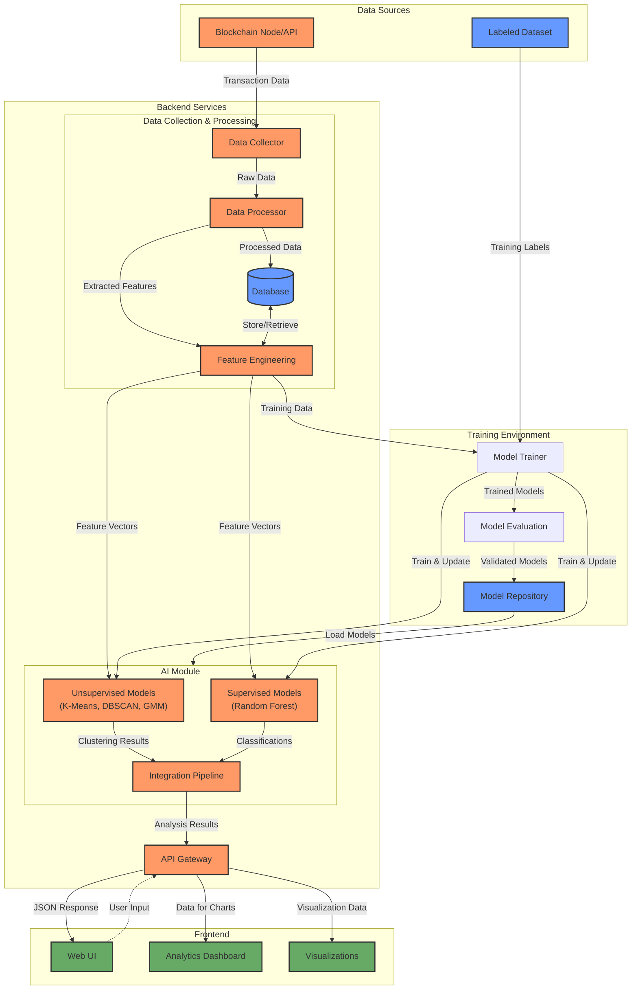
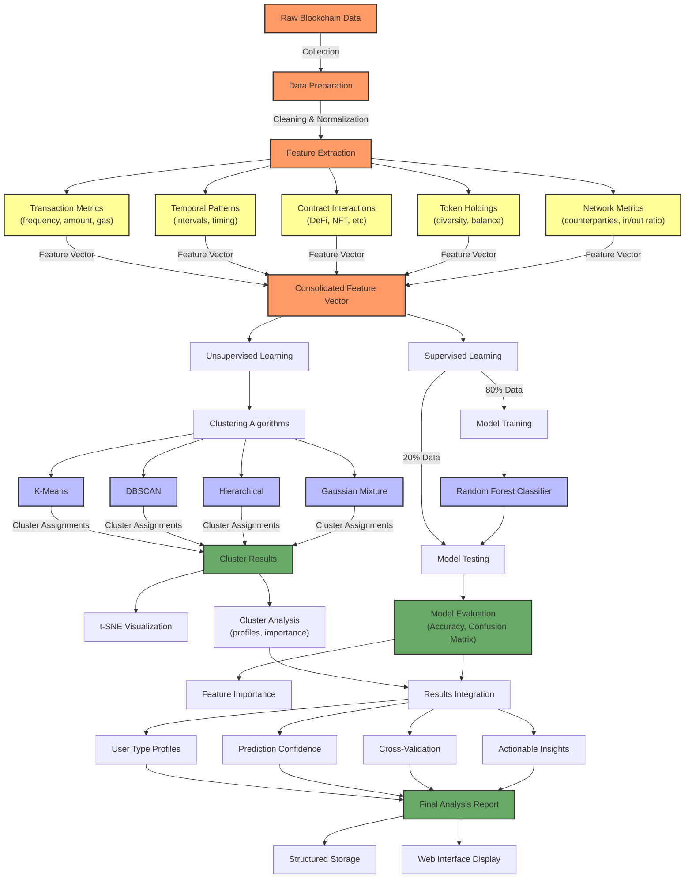
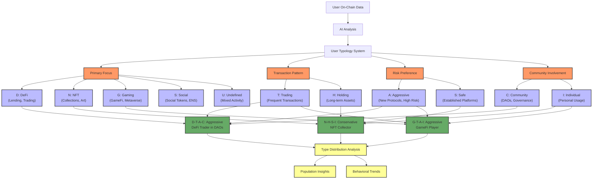

# aidrop-core

# On-Chain User Classification MVP

## Overview

This project is a web-based MVP platform that analyzes EVM blockchain user data using AI. The system connects to a selected EVM-compatible blockchain, collects on-chain data for user addresses, applies trained machine learning models to classify/profile users, and presents the results through a web interface.

## Key Features

- **Blockchain Data Ingestion**: Connect to EVM chains and retrieve on-chain data like transaction history, token holdings, and contract interaction records for wallet addresses
- **Data Processing & Storage**: Parse and normalize raw on-chain data, extract key metrics and features
- **AI Learning & Training**: Construct labeled dataset of addresses with known classifications and train AI/ML models
- **Dual Learning Approach**: Implement both unsupervised (clustering) and supervised (classification) learning
- **User Personality Typing**: Classify users into 16+ distinct types based on four behavioral axes
- **Web Interface**: Web application where users can input wallet addresses and view AI analysis results

## System Architecture



## AI Pipeline Flow



## Typology System Diagram



## Technical Details

### AI Components

1. **Feature Engineering**
   - **Transaction Metrics**: Frequency, average amount, gas usage, etc.
   - **Temporal Patterns**: Transaction intervals, activity time distribution
   - **Contract Interactions**: Types of contracts, interaction frequencies
   - **Token Holdings**: Diversity of tokens, balance distributions
   - **Network Metrics**: Unique counterparties, in/out transaction ratios

2. **Unsupervised Learning (ai_clusturing)**
   - **Algorithms**: K-Means, DBSCAN, Hierarchical Clustering, Gaussian Mixture Models
   - **Dimensionality Reduction**: t-SNE for visualization
   - **Cluster Analysis**: Feature importance per cluster, inter-cluster distance
   - **Silhouette Analysis**: Optimal cluster number determination
   - **Visualization**: 2D representation of user clusters with profiles

3. **Supervised Learning (ai_deduction)**
   - **Algorithm**: Random Forest Classifier
   - **Training Process**: 80/20 train-test split with cross-validation
   - **Model Evaluation**: Accuracy (75-80%), confusion matrix, classification report
   - **Feature Importance**: Ranked contribution of each feature to classification
   - **Model Persistence**: Saved models for future inference

4. **User Typology System**
   - **Four Behavioral Axes**:
     - Primary Focus (D: DeFi / N: NFT / G: Gaming / S: Social / U: Undefined)
     - Transaction Pattern (T: Trading / H: Holding)
     - Risk Preference (A: Aggressive / S: Safe)
     - Community Involvement (C: Community / I: Individual)
   - **16+ Personality Types**: Combinations of these axes (e.g., D-T-S-C, N-H-A-I)
   - **Distribution Analysis**: Population distribution across types

5. **Integration Pipeline (ai_pipeline)**
   - Combines clustering and classification results
   - Cross-validates findings between supervised and unsupervised approaches
   - Generates comprehensive user profiles with prediction confidence
   - Stores analysis results and visualizations in structured format

### Tech Stack

- **Languages**: Python 3.9+
- **AI/ML Libraries**: scikit-learn, pandas, numpy, matplotlib, seaborn
- **Data Processing**: JSON serialization with NumPy type handling
- **Visualization**: matplotlib, t-SNE, confusion matrix plots
- **Storage**: File-based storage with version control

## Implementation Timeline

1. Data collection system development
2. Small dataset labeling and basic model training
3. Model integration into backend API
4. Frontend development and UX improvement

## Future Extensions

- Support for additional EVM chains
- Classification of more user categories
- Enhanced unsupervised learning clustering
- Graph neural network implementation
- Real-time transaction monitoring for behavioral changes

---

# 온체인 사용자 분류 MVP

## 개요

이 프로젝트는 EVM 블록체인 사용자 데이터를 AI로 분석하는 웹 기반 MVP 플랫폼입니다. 시스템은 선택된 EVM 호환 블록체인에 연결하여 사용자 주소의 온체인 데이터를 수집하고, 학습된 머신러닝 모델을 적용하여 사용자를 분류/프로파일링한 후 웹 인터페이스를 통해 결과를 보여줍니다.

## 주요 기능

- **블록체인 데이터 수집**: EVM 체인에 연결하여 지갑 주소의 트랜잭션 기록, 토큰 보유량, 컨트랙트 상호작용 기록 등 온체인 데이터 검색
- **데이터 처리 및 저장**: 원시 온체인 데이터 파싱 및 정규화, 주요 지표 및 특성 추출
- **AI 학습 및 훈련**: 알려진 분류가 있는 주소 데이터셋 구성 및 AI/ML 모델 훈련
- **이중 학습 접근법**: 비지도 학습(클러스터링)과 지도 학습(분류) 모두 구현
- **사용자 성격 유형 분류**: 4가지 행동 축을 기반으로 16개 이상의 고유한 유형으로 사용자 분류
- **웹 인터페이스**: 사용자가 지갑 주소를 입력하고 AI 분석 결과를 볼 수 있는 웹 애플리케이션

## 시스템 아키텍처


## AI 파이프라인 흐름도

```
┌───────────────┐    ┌────────────────┐    ┌─────────────────┐
│ 데이터 수집   │ -> │ 특성 추출/전처리│ -> │ 비지도 학습     │
│ (온체인 데이터)│    │ (feature eng.) │    │ (클러스터링)    │
└───────────────┘    └────────────────┘    └─────────────────┘
                                                   │
                                                   v
┌────────────────┐    ┌────────────────┐    ┌─────────────────┐
│ 결과 제공      │ <- │ 통합 분석      │ <- │ 지도 학습       │
│ (인사이트)     │    │ (파이프라인)   │    │ (분류)          │
└────────────────┘    └────────────────┘    └─────────────────┘
```

## 기술적 세부사항

### AI 구성요소

1. **특성 공학**
   - **트랜잭션 지표**: 빈도, 평균 금액, 가스 사용량 등
   - **시간적 패턴**: 트랜잭션 간격, 활동 시간 분포
   - **컨트랙트 상호작용**: 계약 유형, 상호작용 빈도
   - **토큰 보유량**: 토큰 다양성, 잔액 분포
   - **네트워크 지표**: 고유 거래 상대방, 입출금 트랜잭션 비율

2. **비지도 학습 (ai_clusturing)**
   - **알고리즘**: K-평균, DBSCAN, 계층적 클러스터링, 가우시안 혼합 모델
   - **차원 축소**: t-SNE를 통한 시각화
   - **클러스터 분석**: 클러스터별 특성 중요도, 클러스터 간 거리
   - **실루엣 분석**: 최적 클러스터 수 결정
   - **시각화**: 사용자 클러스터의 2D 표현과 프로필

3. **지도 학습 (ai_deduction)**
   - **알고리즘**: 랜덤 포레스트 분류기
   - **훈련 과정**: 교차 검증이 포함된 80/20 훈련-테스트 분할
   - **모델 평가**: 정확도(75-80%), 혼동 행렬, 분류 보고서
   - **특성 중요도**: 분류에 대한 각 특성의 기여도 순위
   - **모델 지속성**: 향후 추론을 위한 저장된 모델

4. **사용자 유형 시스템**
   - **4가지 행동 축**:
     - 주요 활동 분야 (D: DeFi / N: NFT / G: 게임 / S: 소셜 / U: 미정의)
     - 거래 패턴 (T: 트레이딩 / H: 홀딩)
     - 위험 선호도 (A: 공격적 / S: 안전)
     - 커뮤니티 참여 (C: 커뮤니티 / I: 개인)
   - **16개 이상의 성격 유형**: 이러한 축의 조합(예: D-T-S-C, N-H-A-I)
   - **분포 분석**: 유형별 인구 분포

5. **통합 파이프라인 (ai_pipeline)**
   - 클러스터링 및 분류 결과 결합
   - 지도 및 비지도 접근법 간의 결과 교차 검증
   - 예측 신뢰도가 포함된 종합적인 사용자 프로필 생성
   - 구조화된 형식으로 분석 결과 및 시각화 저장

### 기술 스택

- **언어**: Python 3.9+
- **AI/ML 라이브러리**: scikit-learn, pandas, numpy, matplotlib, seaborn
- **데이터 처리**: NumPy 타입 처리를 통한 JSON 직렬화
- **시각화**: matplotlib, t-SNE, 혼동 행렬 플롯
- **스토리지**: 버전 관리가 포함된 파일 기반 스토리지

## 구현 타임라인

1. 데이터 수집 시스템 구축
2. 소규모 데이터셋 라벨링 및 기본 모델 훈련
3. 모델을 백엔드 API에 통합
4. 프론트엔드 구축 및 사용자 경험 개선

## 확장 가능성

- 추가 EVM 체인 지원
- 더 많은 사용자 카테고리 분류
- 향상된 비지도 학습 클러스터링
- 그래프 신경망 구현
- 행동 변화를 위한 실시간 트랜잭션 모니터링
