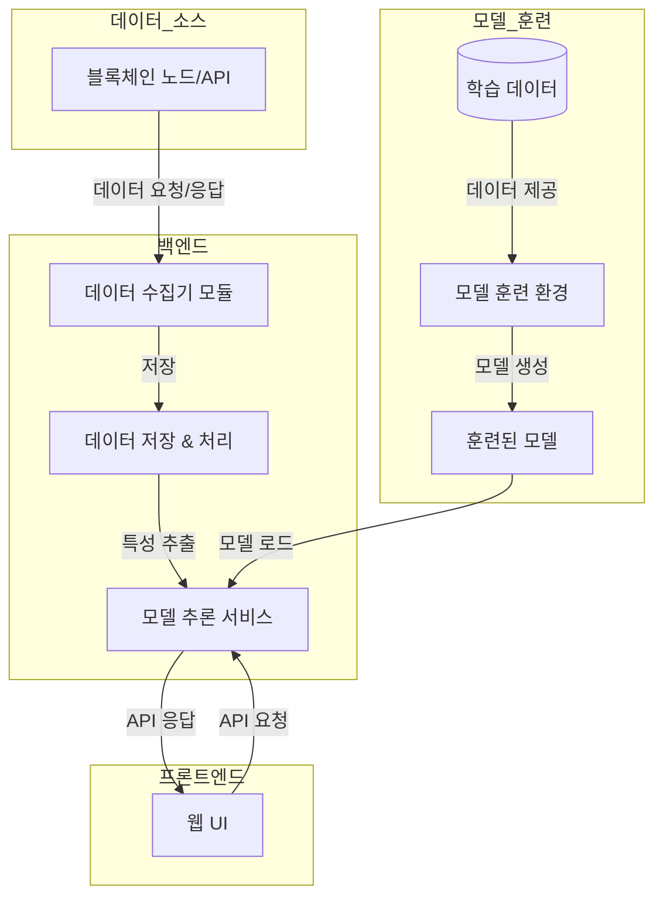

# aidrop-core


# On-Chain User Classification MVP

## 개요

이 프로젝트는 EVM 블록체인 사용자 데이터를 AI로 분석하는 웹 기반 MVP 플랫폼입니다. 시스템은 선택된 EVM 호환 블록체인에 연결하여 사용자 주소의 온체인 데이터를 수집하고, 학습된 머신러닝 모델을 적용하여 사용자를 분류/프로파일링한 후 웹 인터페이스를 통해 결과를 보여줍니다.

## 주요 기능

- **블록체인 데이터 수집**: EVM 체인에 연결하여 지갑 주소의 트랜잭션 기록, 토큰 보유량, 컨트랙트 상호작용 기록 등 온체인 데이터 검색
- **데이터 처리 및 저장**: 원시 온체인 데이터 파싱 및 정규화, 주요 지표 및 특성 추출
- **학습 데이터셋 및 훈련**: 알려진 분류가 있는 주소 데이터셋 구성 및 AI/ML 모델 훈련
- **AI 모델 추론**: 훈련된 모델을 백엔드 서비스에 통합, 새로운 지갑 주소 분석
- **웹 인터페이스**: 사용자가 지갑 주소를 입력하고 AI 분석 결과를 볼 수 있는 웹 애플리케이션

## 시스템 아키텍처



## AI 파이프라인 흐름도

```
┌───────────────┐    ┌────────────────┐    ┌─────────────────┐
│ 데이터 수집   │ -> │ 특성 추출/전처리│ -> │ 비지도 학습     │
│ (온체인 데이터)│    │ (feature eng.) │    │ (클러스터링)    │
└───────────────┘    └────────────────┘    └─────────────────┘
                                                   │
                                                   v
┌────────────────┐    ┌────────────────┐    ┌─────────────────┐
│ 결과 제공      │ <- │ 통합 분석      │ <- │ 지도 학습       │
│ (인사이트)     │    │ (파이프라인)   │    │ (분류)          │
└────────────────┘    └────────────────┘    └─────────────────┘
```

## 기술 스택

### 백엔드
- **언어**: Python (web3.py, Flask/FastAPI, pandas, scikit-learn, XGBoost)
- **데이터베이스**: SQLite/PostgreSQL
- **API**: Etherscan, Covalent, JSON-RPC

### 프론트엔드
- **프레임워크**: React.js
- **UI 라이브러리**: Bootstrap/Material UI
- **차트**: Chart.js/D3.js (선택적)

## EVM 체인 선택

MVP를 위해 Ethereum 메인넷이 권장됩니다. 그 이유:
- 가장 다양한 사용자 활동 (DeFi, NFT, 게임, 거래소)
- 개발자 도구 및 데이터 소스 지원 우수
- 분류를 위한 라벨링 데이터 접근성이 높음

## 데이터 라벨링 전략

- 오픈 데이터셋 및 연구 활용
- 휴리스틱 라벨링 규칙 생성
- 알려진 엔티티 태그 활용
- 수동 라벨링 (프로토타입용)

## AI 모델 파이프라인

### 특성 공학 및 전처리
- 활동 지표 (트랜잭션 수, 빈도)
- 트랜잭션 특성 (평균 값, 가스비)
- 상대방 분석
- 스마트 컨트랙트 상호작용
- 토큰 보유량
- 계정 나이 및 수명
- 트랜잭션 패턴

### 모델 아키텍처
- 트리 기반 모델 (Random Forest/XGBoost)
- 훈련 데이터 80%, 테스트 데이터 20% 분할
- 교차 검증 사용

## 웹 앱 상호작용

1. 사용자가 지갑 주소 입력
2. 백엔드가 데이터 수집 및 처리
3. AI 모델이 분류 수행
4. 결과 및 지원 정보 표시 (분류 라벨, 신뢰도, 주요 특성)

## 구현 타임라인

1. 데이터 수집 시스템 구축
2. 소규모 데이터셋 라벨링 및 기본 모델 훈련
3. 모델을 백엔드 API에 통합
4. 프론트엔드 구축 및 사용자 경험 개선

## 확장 가능성

- 추가 EVM 체인 지원
- 더 많은 사용자 카테고리 분류
- 비지도 학습 클러스터링
- 그래프 신경망 구현
